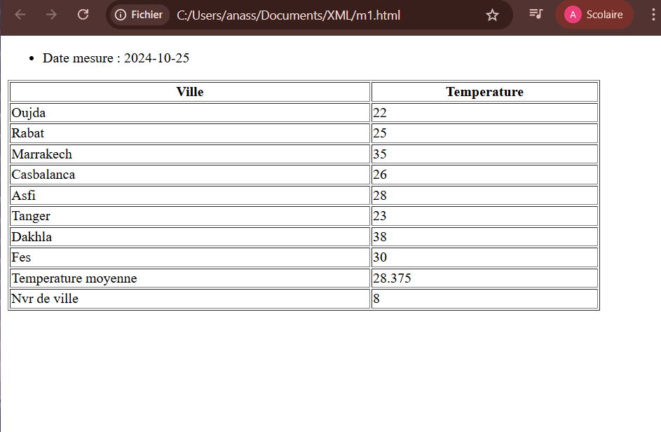
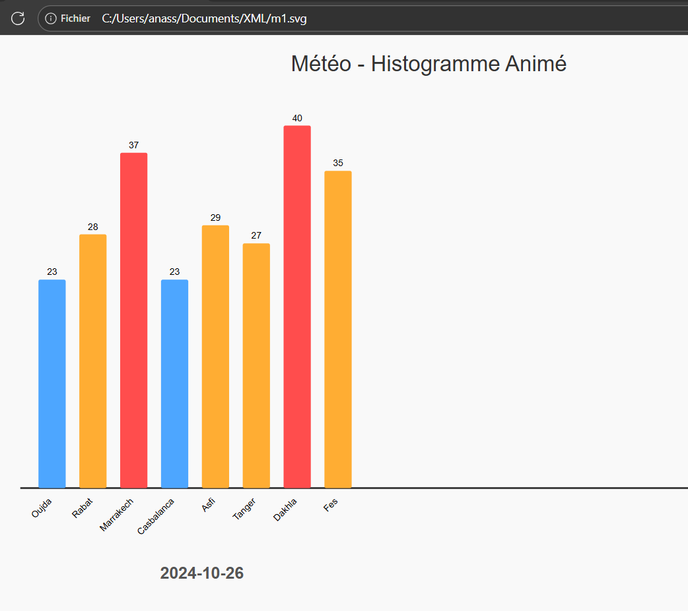

# Projet de Visualisation de Données Météorologiques

Ce projet illustre la manipulation et la visualisation de données météorologiques XML à l'aide de transformations XSLT vers HTML et SVG.

## Description

Le but de ce projet est de présenter des relevés de températures pour différentes villes marocaines sur plusieurs dates. Les données sont stockées au format XML et transformées pour deux types de visualisation :
1.  **Tableau HTML** : Une liste structurée des températures.
2.  **Histogramme SVG Animé** : Un graphique visuel et animé montrant les températures.

## Aperçu

### Visualisation HTML

### Visualisation SVG

